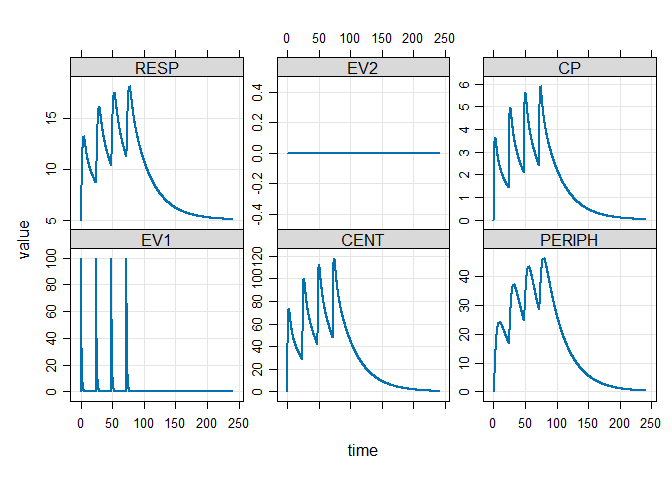

Basic Example
================
Ruben Cabrera
2024-08-16

## Basic Example

Basic Example

``` r
library(mrgsolve)
library(ggplot2)
```

## Model

Pre-coded model from an internal library

``` r
mod <- modlib("irm2")
```

    ## Building irm2 ... done.

``` r
mod
```

    ## 
    ## 
    ## -----------------  source: irm2.cpp  -----------------
    ## 
    ##   project: C:/Users/ruben/A...gsolve/models
    ##   shared object: irm2-so-5841fd12759 
    ## 
    ##   time:          start: 0 end: 24 delta: 1
    ##                  add: <none>
    ## 
    ##   compartments:  EV1 CENT PERIPH RESP EV2 [5]
    ##   parameters:    CL VC Q VP KA1 KA2 KIN KOUT IC50 IMAX n
    ##                  VMAX KM [13]
    ##   captures:      CP [1]
    ##   omega:         0x0 
    ##   sigma:         0x0 
    ## 
    ##   solver:        atol: 1e-08 rtol: 1e-08 maxsteps: 20k
    ## ------------------------------------------------------

``` r
# Intervaton for the model. We do this with an event object
e <- ev(amt=100,ii=24,addl=3)

out <- mod %>% ev(e) %>% mrgsim(end=240,delta=0.1)
out
```

    ## Model:  irm2 
    ## Dim:    2402 x 8 
    ## Time:   0 to 240 
    ## ID:     1 
    ##     ID time    EV1   CENT  PERIPH  RESP EV2     CP
    ## 1:   1  0.0   0.00  0.000 0.00000 5.000   0 0.0000
    ## 2:   1  0.0 100.00  0.000 0.00000 5.000   0 0.0000
    ## 3:   1  0.1  90.48  9.444 0.04781 5.098   0 0.4722
    ## 4:   1  0.2  81.87 17.851 0.18294 5.322   0 0.8926
    ## 5:   1  0.3  74.08 25.323 0.39390 5.613   0 1.2662
    ## 6:   1  0.4  67.03 31.953 0.67040 5.940   0 1.5977
    ## 7:   1  0.5  60.65 37.824 1.00324 6.288   0 1.8912
    ## 8:   1  0.6  54.88 43.013 1.38417 6.645   0 2.1507

## Plot data

``` r
plot(out)
```

<!-- -->

## Model

``` r
#$PROB

#$PARAM
```
